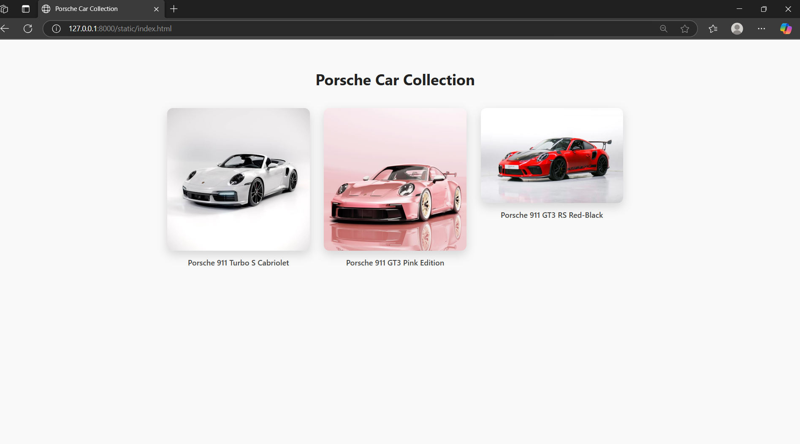
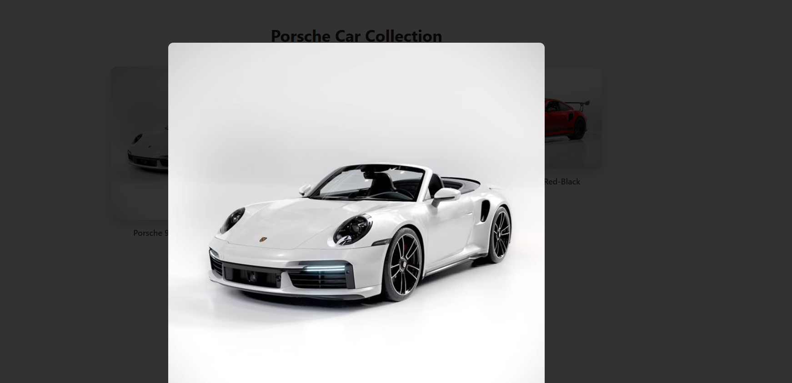
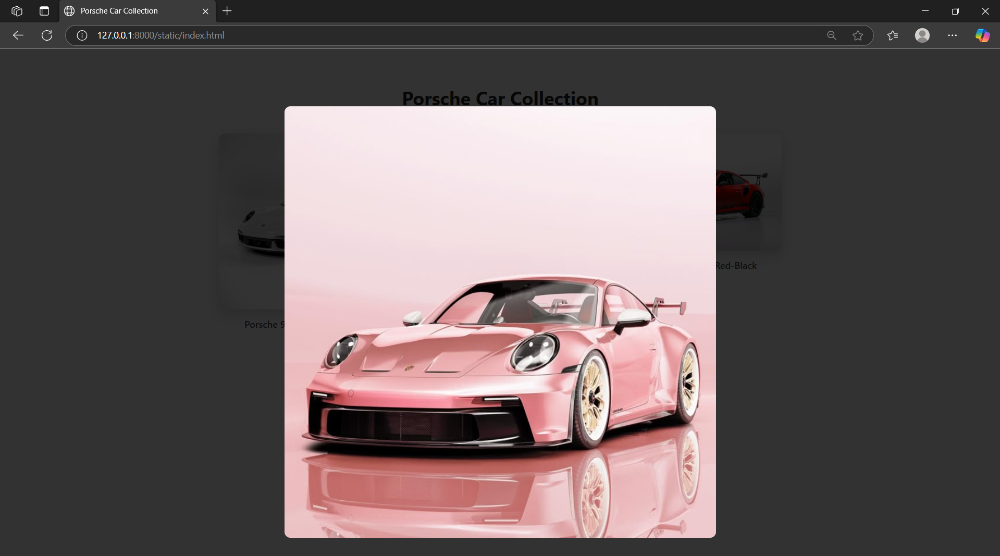
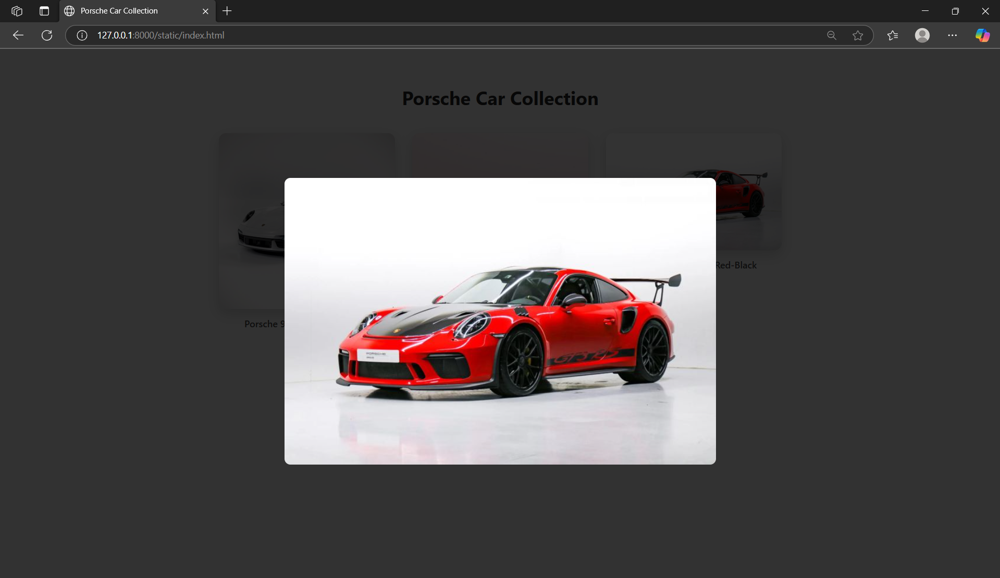

# Ex.08 Design of Interactive Image Gallery
## Date:17.05.2025

## AIM:
To design a web application for an inteactive image gallery with minimum five images.

## DESIGN STEPS:

### Step 1:
Clone the github repository and create Django admin interface.

### Step 2:
Change settings.py file to allow request from all hosts.

### Step 3:
Use CSS for positioning and styling.

### Step 4:
Write JavaScript program for implementing interactivity.

### Step 5:
Validate the HTML and CSS code.

### Step 6:
Publish the website in the given URL.

## PROGRAM :
```
<!DOCTYPE html>
<html lang="en">
<head>
  <meta charset="UTF-8" />
  <meta name="viewport" content="width=device-width, initial-scale=1.0"/>
  <title>Porsche Car Collection</title>
  <style>
    body {
      margin: 0;
      background-color: #f9f9f9;
      font-family: 'Segoe UI', Tahoma, Geneva, Verdana, sans-serif;
      display: flex;
      flex-direction: column;
      align-items: center;
      padding: 40px 20px;
    }

    h1 {
      text-align: center;
      color: #222;
      margin-bottom: 40px;
    }

    .gallery {
      display: flex;
      gap: 30px;
      flex-wrap: wrap;
      justify-content: center;
    }

    .car-container {
      text-align: center;
    }

    .car-image {
      max-width: 300px;
      height: auto;
      border-radius: 12px;
      box-shadow: 0 8px 20px rgba(0, 0, 0, 0.15);
      background-color: white;
      cursor: pointer;
      transition: transform 0.3s ease;
    }

    .car-image:hover {
      transform: scale(1.05);
    }

    .caption {
      margin-top: 10px;
      font-weight: 500;
      color: #444;
    }

    /* Popup Lightbox */
    .lightbox {
      position: fixed;
      top: 0; left: 0;
      width: 100vw; height: 100vh;
      background: rgba(0, 0, 0, 0.8);
      display: none;
      justify-content: center;
      align-items: center;
      z-index: 1000;
    }

    .lightbox img {
      max-width: 90%;
      max-height: 90%;
      border-radius: 10px;
    }

    .lightbox.active {
      display: flex;
    }
  </style>
</head>
<body>

  <h1>Porsche Car Collection</h1>

  <div class="gallery">
    <div class="car-container">
      
      <div class="caption">Porsche 911 Turbo S Cabriolet</div>
    </div>

    <div class="car-container">
      
      <div class="caption">Porsche 911 GT3 Pink Edition</div>
    </div>

    <div class="car-container">
      
      <div class="caption">Porsche 911 GT3 RS Red-Black</div>
    </div>
  </div>

  <!-- Lightbox -->
  <div class="lightbox" id="lightbox" onclick="closeLightbox()">
    
  </div>

  <script>
    function openLightbox(src) {
      document.getElementById("lightbox-img").src = src;
      document.getElementById("lightbox").classList.add("active");
    }

    function closeLightbox() {
      document.getElementById("lightbox").classList.remove("active");
    }
  </script>

</body>
</html>

```
## OUTPUT:





## RESULT:
The program for designing an interactive image gallery using HTML, CSS and JavaScript is executed successfully.
